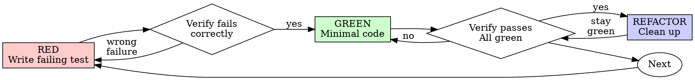

# Test-Driven Development (TDD)

## Overview

Write the test first. Watch it fail for the right reason. Write the smallest amount of production code that makes it pass, then refactor with tests green.

**Core principle:** If you never saw the test fail, you do not know whether it asserts what you think it asserts.

**Violating the letter of the rules is violating the spirit of the rules.**

## Scope (when this skill applies)

The YAML `description` lists trigger situations; that list is what makes the skill discoverable—treat it as authoritative for “should I load this skill?”

**Default:** new behavior, bug fixes, refactors that can change outcomes, and any change where regressions matter.

**Exceptions (confirm with the user):** throwaway prototypes, generated-only code, pure configuration with no logic.

If you catch yourself thinking “just this once without a failing test first,” pause—that is almost always rationalization.

## The rule

**No production code without a failing test first.**

If production code already exists before a real failing test: remove it (or revert the change) and restart from RED. Keeping it as “reference” or “adapting it while writing tests” is still test-last; the discipline is to implement from tests that already proved they can fail.

## Red-Green-Refactor

High-level cycle (Graphviz): RED → confirm failure → GREEN → confirm pass → REFACTOR → next behavior.



### RED — write a failing test

Write one small test that describes the next slice of behavior.

**Good example**

```typescript
test('retries failed operations 3 times', async () => {
  let attempts = 0;
  const operation = () => {
    attempts++;
    if (attempts < 3) throw new Error('fail');
    return 'success';
  };

  const result = await retryOperation(operation);

  expect(result).toBe('success');
  expect(attempts).toBe(3);
});
```

Clear name, exercises real behavior, one concern.

**Bad example**

```typescript
test('retry works', async () => {
  const mock = jest.fn()
    .mockRejectedValueOnce(new Error())
    .mockRejectedValueOnce(new Error())
    .mockResolvedValueOnce('success');
  await retryOperation(mock);
  expect(mock).toHaveBeenCalledTimes(3);
});
```

Vague name; mostly proves the mock was called, not that your code integrates sensibly.

**Aim for:** one behavior, a name that reads like a spec, real collaborators where possible (mocks only when unavoidable).

### Verify RED — watch it fail

This step exists because a test that “passes by accident” or errors for the wrong reason gives false confidence.

Run **the project’s** test command, for example:

- `npm test`, `pnpm test`, `yarn test`
- `pytest`, `python -m pytest`
- `go test ./...`
- `cargo test`
- `dotnet test`

Use a narrow path or filter when the suite is large, but always execute a real run—not only “it should fail in theory.”

Confirm:

- The assertion fails (not a compile/syntax/import error unless that is what you are testing).
- The failure message matches missing behavior, not a typo in the test.

If the test passes: you are likely testing something already true—adjust the test until it fails for the right reason. If it errors: fix the test harness first, then re-run until you get a clean, expected failure.

**Before you leave RED:** if the test imports a module that does not exist yet, the “failure” is often a compile or resolution error. That is acceptable only briefly—adjust the test or add the smallest exported stub so the next run fails on behavior (assertion), not on missing files.

### GREEN — minimal code

Write the simplest production code that satisfies the test—no extra features, no drive-by refactors.

**GREEN is not done** until the code under test exists, compiles, and the same test file you used in RED turns green when you run the real test command again. Stopping with only a test file and no implementation is still an incomplete cycle.

**Good example**

```typescript
async function retryOperation<T>(fn: () => Promise<T>): Promise<T> {
  for (let i = 0; i < 3; i++) {
    try {
      return await fn();
    } catch (e) {
      if (i === 2) throw e;
    }
  }
  throw new Error('unreachable');
}
```

**Bad example**

```typescript
async function retryOperation<T>(
  fn: () => Promise<T>,
  options?: {
    maxRetries?: number;
    backoff?: 'linear' | 'exponential';
    onRetry?: (attempt: number) => void;
  }
): Promise<T> {
  // YAGNI
}
```

### Verify GREEN — watch it pass

Run the same test command again. Confirm the new test passes, the rest of the suite stays green, and output is clean enough for your project’s standards (no new errors or warnings you introduced).

If the new test fails, fix production code—not the test—unless the test was wrong about the desired behavior.

If you need evidence of the cycle for reviewers (or for your own later self), keep something lightweight: copy the relevant failing and passing lines from the test run into the commit message, PR description, or task notes—no separate harness folder is required.

### REFACTOR — clean up

Only after green: remove duplication, improve names, extract helpers. Keep behavior stable; do not sneak in new requirements.

### Repeat

Pick the next failing test for the next slice of behavior.

## Good tests

| Quality | Good | Bad |
|---------|------|-----|
| **Minimal** | One thing. “And” in the name? Split it. | `test('validates email and domain and whitespace')` |
| **Clear** | Name describes behavior | `test('test1')` |
| **Shows intent** | Demonstrates the API you want | Obscures what the unit should do |

## Why order matters

**“I’ll write tests after to verify it works.”**

Tests written after code often pass immediately. That proves the test runs, not that it would have caught a wrong implementation. Test-first forces you to see a meaningful failure before the feature exists.

**“I already manually exercised the edge cases.”**

Manual checks are not repeatable documentation. Automated tests run the same way on every change.

**“Deleting work is wasteful.”**

Sunk cost: keeping unverified code trades a small redo now for larger debugging later.

**“TDD is dogmatic; pragmatism means flexibility.”**

Pragmatism for production systems usually means *finding* defects before merge. TDD is one of the fastest feedback loops for that.

**“Tests after have the same spirit.”**

Tests-after often encode “what did I build?” Tests-first encode “what should happen?”—including edge cases you might forget once code exists.

## Common rationalizations

| Excuse | Reality |
|--------|---------|
| “Too simple to test” | Simple code still breaks; the test is often cheap. |
| “I’ll test after” | Immediate green tests do not prove detection power. |
| “Tests after achieve same goals” | Different question: documenting behavior vs. discovering required behavior. |
| “Already manually tested” | Ad-hoc runs are hard to replay and easy to forget. |
| “Deleting X hours is wasteful” | Unverified code is debt with interest. |
| “Keep as reference, write tests first” | Reference code drifts into test-last. |
| “Need to explore first” | Exploration is fine; throw it away or isolate it, then TDD from the boundary you keep. |
| “Test is hard to write” | Often signals a design that is hard to use—listen and simplify. |
| “TDD will slow me down” | Compare to production debugging and rework. |
| “Existing code has no tests” | Add tests around what you change; prefer characterization tests before edits. |

## Red flags — stop and reset

- Production code before a failing test
- Tests added only after implementation without a recorded failing run
- New test passes on first run without you having seen a relevant failure
- A new test imports production code that was never added (or never finished): you are not past GREEN—complete the module, then re-run until green
- You cannot explain why the test failed before the fix
- Rationalizations like “just this once,” “spirit not ritual,” or “keep as reference”

**Reset:** remove or revert the production change, return to RED with a test that fails for the right reason, then proceed.

## Example: bug fix

**Bug:** empty email accepted.

**RED**

```typescript
test('rejects empty email', async () => {
  const result = await submitForm({ email: '' });
  expect(result.error).toBe('Email required');
});
```

**Verify RED**

```bash
$ npm test
FAIL: expected 'Email required', got undefined
```

**GREEN**

```typescript
function submitForm(data: FormData) {
  if (!data.email?.trim()) {
    return { error: 'Email required' };
  }
  // ...
}
```

**Verify GREEN**

```bash
$ npm test
PASS
```

**REFACTOR**

Extract shared validation if multiple fields need the same pattern.

## Verification checklist

Before marking work complete:

- [ ] Every new function or method that carries behavior has coverage via this cycle
- [ ] The production code that satisfies the new test exists in the repo (not only the test file)
- [ ] You watched each new test fail before implementation
- [ ] Each failure was for the expected reason (missing behavior, not accidental green)
- [ ] You wrote minimal code to pass each test
- [ ] Full suite passes
- [ ] No new noise (errors or warnings your change introduced)
- [ ] Tests favor real code paths; mocks only where necessary
- [ ] Important edge cases and errors are covered

If you cannot honestly check these, treat the work as not yet TDD-complete.

## When stuck

| Problem | Solution |
|---------|----------|
| Unsure how to test | Sketch the API you wish existed; write the assertion first; ask your human partner. |
| Test is very complicated | Simplify the seam under test (smaller surface, clearer inputs/outputs). |
| Everything needs mocks | Likely tight coupling—introduce seams (DI, ports) so behavior is testable. |
| Huge setup | Extract builders/fixtures; if setup stays huge, the design may still be doing too much at once. |

## Debugging and regressions

When you find a bug, write a failing test that reproduces it, then fix via RED → GREEN → REFACTOR. The test documents the defect and prevents regression.

Avoid “fix-only” changes with no automated proof.

## Testing anti-patterns

When you add mocks, doubles, or test utilities, read `testing-anti-patterns.md` in this skill folder to avoid:

- asserting on mock behavior instead of outcomes
- test-only API on production types
- mocking without understanding dependencies

## Final rule

**Production code may only exist alongside tests that have failed first for a relevant reason.**

Exceptions need explicit agreement from the user—not silent shortcuts.
